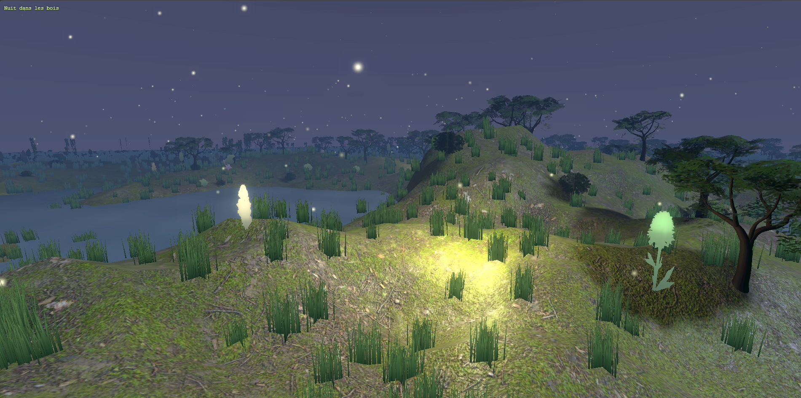

# Nuit dans les bois

Projet Three.js — HETIC 2026.

Scène 3D nocturne : terrain généré, forêt dense, étang et lucioles.



## Lancement

Un simple serveur HTTP suffit, pas de build :

```bash
python -m http.server 8000
```

Puis http://localhost:8000.

## Stack

- Three.js 0.132.2 via esm.sh
- simplex-noise 4.0.1
- Textures ambientCG (CC0)

Pas de npm, pas de bundler.

## Ce qui est fait

Toutes les étapes du sujet :

- Terrain procédural (Simplex FBM, falloff radial sur les bords)
- Sol PBR (color + normal + roughness + AO)
- Herbe en InstancedMesh (15 000 touffes, scatterées aléatoirement)
- Skybox en shader (gradient nuit + étoiles scintillantes)
- Buissons en InstancedMesh (plans croisés)
- 400 arbres avec LOD 3 niveaux + impostor billboard généré au runtime
- Plan d'eau en shader custom (ondes concentriques qui se propagent)
- Fog exponentiel + 3 lumières (lune directionnelle, hémisphère, ambient)
- 400 lucioles en particules avec additive blending et clignotement
- Bloom en post-process (EffectComposer + UnrealBloomPass)

Bonus :

- 6 lucioles "héros" avec PointLight qui suit la particule et éclaire le sol
- Shader de vent sur l'herbe
- Plantes à fleurs en 5 variantes (600 instances)

## Architecture

```
scene-nature/
├── index.html
├── main.js
├── src/
│   ├── core/          SceneManager, PostProcessing
│   ├── world/         Terrain, Skybox, Water, Lighting, Fog, GroundMaterial
│   ├── vegetation/    Grass, Bushes, Plants, Trees
│   ├── effects/       ParticleEngine, HeroFireflies, Impostor
│   ├── shaders/       sky, water, grassWind, plantTint
│   ├── loaders/       AssetManager
│   └── utils/         Noise, Scatter, CrossPlanes
└── assets/
    ├── models/
    └── textures/
```

Chaque module expose un `mesh` ou un `group`, et éventuellement une méthode `update(delta)`. Le `SceneManager` s'occupe de la loop et appelle `update` sur tous les modules enregistrés avec `add()`.

## Notes

Testé sur Chrome et Edge. Rendu un peu différent sur Opera GX (probablement lié aux limiters GPU), rien de grave.

Ryan